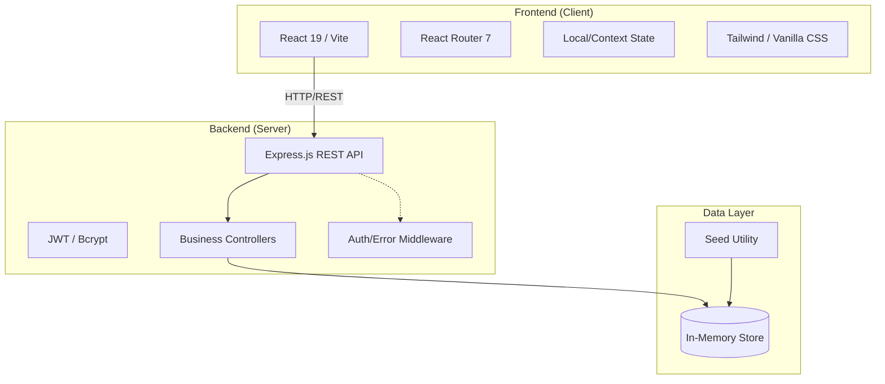
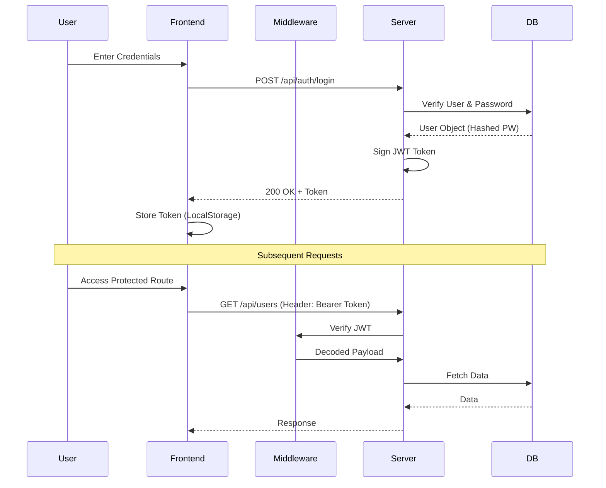
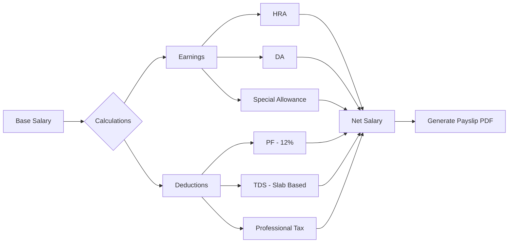

# 🚀 EmPay — Smart Human Resource Management System

[](https://github.com/omkarsp03/EmPay-Smart-Human-Resource-Management-System)
[](https://opensource.org/licenses/MIT)
[]()

EmPay is a high-performance, premium HRMS platform designed with a **Glassmorphism / iOS-inspired** aesthetic. It streamlines complex HR operations including payroll processing, attendance tracking, and employee management through a sleek, intuitive interface.


---

## 🏛️ Architecture Overview

EmPay follows a decoupled **Client-Server Architecture** optimized for scalability and rapid prototyping.



---

## ✨ Key Features

-   **💎 Premium UI/UX:** Advanced glassmorphism design with aurora gradients and iOS-style micro-animations.
-   **📊 Real-time Analytics:** Interactive dashboards using Recharts for attendance trends and department distribution.
-   **💰 Automated Payroll:** Complex tax calculation engine (TDS, PT, PF) with payslip generation (PDF support).
-   **📅 Smart Attendance:** Daily check-in/out tracking with automatic work hour calculations.
-   **🌴 Leave Management:** Comprehensive workflow for leave applications and multi-level approvals.
-   **🔐 Secure Auth:** Role-based access control (Admin, HR, Employee) secured with JWT.

---

## 📈 Unique System Graphs

### 1. User Authentication & Authorization Flow


### 2. Payroll Processing Pipeline


---

## 🛠️ Technology Stack

| Component | Technology | Role |
| :--- | :--- | :--- |
| **Frontend** | React 19, Vite | Core Framework |
| **Routing** | React Router 7 | Navigation |
| **Icons** | Lucide React | Visual Language |
| **Charts** | Recharts | Data Visualization |
| **Backend** | Node.js, Express | Server Engine |
| **Auth** | JWT, Bcrypt.js | Security |
| **PDF** | JSPDF, html2canvas | Document Generation |
| **Styling** | Vanilla CSS (Glassmorphism) | Visual Aesthetic |

---

## 🚀 Getting Started

### Prerequisites
- Node.js (v18+)
- npm / yarn

### Installation

1. **Clone the repository**
   ```bash
   git clone https://github.com/omkarsp03/EmPay-Smart-Human-Resource-Management-System.git
   cd EmPay-Smart-Human-Resource-Management-System
   ```

2. **Setup Server**
   ```bash
   cd server
   npm install
   npm start
   ```

3. **Setup Client**
   ```bash
   cd ../client
   npm install
   npm run dev
   ```

---

## 👨‍💼 Demo Accounts

| Role | Email | Password |
| :--- | :--- | :--- |
| **Admin** | `admin@empay.com` | `admin123` |
| **HR** | `hr@empay.com` | `hr123` |
| **Employee** | `john@empay.com` | `emp123` |

---

## 📄 License

Distributed under the MIT License. See `LICENSE` for more information.

---

Created with ❤️ by the EmPay Team.